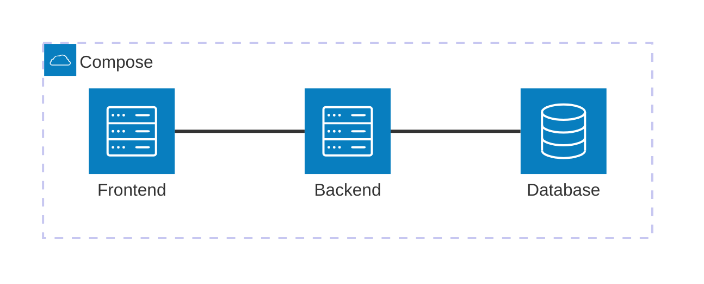

# Ant ID Training

Plateforme d'entraînement à l'identification des fourmis.

Le projet est un monorepo avec:
- un frontend en React + Vite + TypeScript + Tailwind CSS
- un backend en Express + Prisma + PostgreSQL
- un déploiement Docker Compose pour lancer l'ensemble rapidement

## Vue d'ensemble



## Structure du dépôt

- [apps/frontend](apps/frontend) : interface utilisateur, pages publiques et administration
- [apps/backend](apps/backend) : API, Prisma et outils admin
- [README backend](apps/backend/README.md) : détail du backend
- [README frontend](apps/frontend/README.md) : détail du frontend
 - [Documentation frontend component map](docs/frontend-component-map.md) : carte des composants et intégration backend

## Démarrage rapide avec Docker

Prérequis: Docker et Docker Compose.

1. Copier les variables d'environnement:

```bash
cp .env.example .env
cp apps/backend/.env.example apps/backend/.env
```

2. Lancer l'application:

```bash
npm run docker:up
```

3. Ouvrir:

- Frontend: http://localhost:8080
- Backend health: http://localhost:4000/api/health
- Swagger UI: http://localhost:4000/api/docs
- OpenAPI JSON: http://localhost:4000/api/openapi.json
- PostgreSQL: localhost:5432

## Démarrage en local

1. Installer les dépendances:

```bash
npm install
```

2. Préparer l'environnement backend:

```bash
cp apps/backend/.env.example apps/backend/.env
```

3. Lancer la stack de développement:

```bash
npm run dev
```

Raccourcis utiles:
- Frontend: http://localhost:5173
- Backend: http://localhost:4000

## Scripts racine

- `npm run dev` : frontend + backend en mode développement
- `npm run build` : build des deux applications
- `npm run db:generate` : génération Prisma Client
- `npm run db:migrate` : migration Prisma locale
- `npm run docker:up` : démarrage Docker Compose
- `npm run docker:down` : arrêt Docker Compose
- `npm run docker:logs` : logs des conteneurs

## Licence

Le code source est publié sous une licence propriétaire restrictive. Voir [LICENSE](LICENSE).
