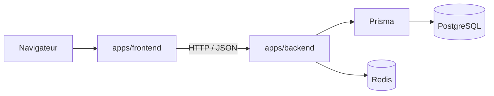

# Architecture globale

## Vue d'ensemble

Ant ID Training est un monorepo npm workspaces avec deux applications :

- **[Frontend](../apps/frontend)** : React + Vite + TypeScript + Tailwind CSS
- **[Backend](../apps/backend)** : Express + Prisma + PostgreSQL + Redis

## Flux principal



## Rôles des couches

### Frontend

- Pages routées avec React Router
- État serveur géré avec React Query
- Client API centralisé dans [`apps/frontend/src/lib/api.ts`](../apps/frontend/src/lib/api.ts)
- Vues publiques (jeu, taxons, références, leaderboard) et vue admin

### Backend

- Routes Express regroupées par domaine dans [`apps/backend/src/routes/`](../apps/backend/src/routes)
- Validation des entrées avec Zod
- Logique métier dans [`apps/backend/src/services/`](../apps/backend/src/services)
- Accès base via Prisma, cache via Redis (ioredis)
- Gestion des erreurs centralisée avec `errorId` sur les 500
- Authentification par cookie JWT `adminToken` ou header Bearer

### Données et cache

- PostgreSQL stocke le modèle métier
- Prisma gère le schéma et les migrations
- Redis : rate limiting par IP et cache des entrées de jeu (TTL 60 s)

## Sécurité

- **Headers** : Helmet + CORS restreint aux origines configurées
- **Auth** : JWT signé, middleware `requireAuth` / `requireAdmin`
- **Rate limiting** : par IP via Redis sur les endpoints sensibles (login, register, jeu, reset de mot de passe)
- **Uploads** : validation MIME + réécriture en WebP via sharp ; taille max 8 Mo
- **Chiffrement** : champs PII (photoCredit, nom/email de suggestion) chiffrés AES-256-GCM avec `DATA_ENCRYPTION_KEY`
- **Tokens sensibles** : le token de reset de mot de passe est stocké haché (SHA-256), jamais en clair

## Variables d'environnement

### Obligatoires

| Variable       | Description                 |
| -------------- | --------------------------- |
| `DATABASE_URL` | Connexion PostgreSQL        |
| `JWT_SECRET`   | Secret de signature des JWT |

### Obligatoires en production

| Variable              | Description                                |
| --------------------- | ------------------------------------------ |
| `CORS_ORIGINS`        | Origines autorisées (séparées par virgule) |
| `DATA_ENCRYPTION_KEY` | Clé de chiffrement AES pour les champs PII |

### Optionnelles

| Variable                         | Défaut                  | Description                                            |
| -------------------------------- | ----------------------- | ------------------------------------------------------ |
| `PORT`                           | `4000`                  | Port d'écoute du backend                               |
| `REDIS_URL`                      | —                       | Connexion Redis                                        |
| `TRUST_PROXY`                    | `loopback, uniquelocal` | Niveau de confiance proxy Express (RFC1918 par défaut) |
| `RESEND_API_KEY`                 | —                       | Clé Resend pour l'envoi d'e-mails                      |
| `RESEND_FROM`                    | —                       | Adresse expéditrice                                    |
| `FRONTEND_URL`                   | `http://localhost:5173` | URL du frontend (liens dans les e-mails)               |
| `SEND_LOGIN_NOTIFICATION_EMAILS` | `true`                  | Désactiver avec `false`                                |

## Démarrage

```bash
npm run dev          # frontend + backend en parallèle
npm run docker:up    # environnement complet via Docker Compose
```

Docker Compose démarre PostgreSQL, Redis, le backend et le frontend. Le backend expose le port 4000, le frontend le port 8080.
