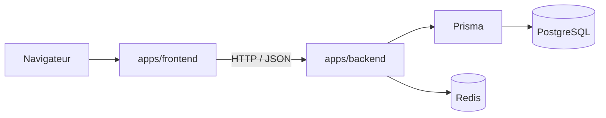

# Architecture globale

## Vue d'ensemble

Ant ID Training est organisé en monorepo avec deux applications principales :

- [Frontend](../apps/frontend) : React + Vite + TypeScript + Tailwind CSS
- [Backend](../apps/backend) : Express + Prisma + PostgreSQL + Redis

Le dépôt est conçu pour séparer clairement l'interface utilisateur, la logique métier et la persistance des données.

## Flux principal

## Rôles des couches

### Frontend

- Pages routées avec React Router
- État serveur géré avec React Query
- Client API centralisé dans [apps/frontend/src/lib/api.ts](../apps/frontend/src/lib/api.ts)
- Affichage des vues publiques et administrateur

### Backend

- Routes Express regroupées par domaine dans [apps/backend/src/routes](../apps/backend/src/routes)
- Validation des entrées avec Zod
- Logique métier dans les services
- Accès base via Prisma
- Gestion des erreurs centralisée
- Authentification par cookie JWT ou header Bearer

### Données et cache

- PostgreSQL stocke le modèle métier
- Prisma gère le schéma et les migrations
- Redis est utilisé pour le rate limiting et certains caches applicatifs

## Sécurité et exploitation

- Helmet et CORS sont configurés côté backend
- Les uploads d'images passent par une validation MIME et une réécriture en WebP
- Les routes sensibles utilisent `requireAuth` et `requireAdmin`
- Les erreurs serveur renvoient un `errorId` pour faciliter le support

## Démarrage et environnements

- Docker Compose pilote l'ensemble en local ou en déploiement
- Le backend requiert au minimum `DATABASE_URL` et `JWT_SECRET`
- `CORS_ORIGINS` est obligatoire en production
