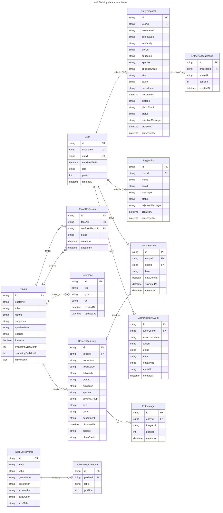

# Schéma de base de données

Documentation rapide du modèle Prisma de la base antIdTraining.

## Lecture rapide

- `User` : comptes admin et utilisateur, identifiés par un nom d’utilisateur et une adresse e-mail, avec validation e-mail avant activation.
- `Taxon` : référentiel scientifique principal.
- `TaxonConfusion` : confusions possibles entre taxons, avec explication, enregistrées de façon miroir pour apparaître sur les deux taxons.
- `ObservationEntry` : entrées de jeu et observations.
- `GameSession` : historique des parties.
- `EntryProposal` : propositions de contribution utilisateur.
- `AdminHistoryEvent` : audit des actions d’administration.
- `Reference` et `Suggestion` : documentation et retours utilisateurs.
