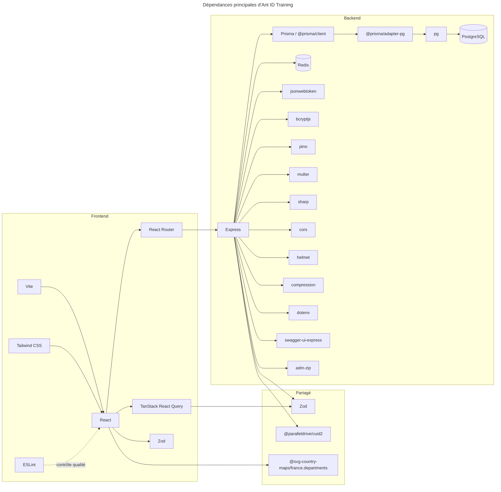

# Schéma de dépendances

Ce document résume les dépendances principales du projet et leur utilité.

## Vue d'ensemble

## Détail des dépendances

### Frontend

| Dépendance | Utilité |
| --- | --- |
| React | Construction de l'interface utilisateur. |
| React Router | Navigation entre les pages. |
| TanStack React Query | Cache, synchronisation et gestion des requêtes serveur. |
| Zod | Validation des données côté client et partage de schémas avec le backend. |
| Vite | Serveur de développement et build de production. |
| Tailwind CSS | Styles utilitaires de l'interface. |
| ESLint | Analyse statique et cohérence du code. |

### Partagé

| Dépendance | Utilité |
| --- | --- |
| Zod | Schémas de validation et typage des payloads. |
| @paralleldrive/cuid2 | Génération d'identifiants courts et uniques. |
| @svg-country-maps/france.departments | Données cartographiques pour l'affichage des départements. |

### Backend

| Dépendance | Utilité |
| --- | --- |
| Express | Serveur HTTP et routage de l'API. |
| Prisma / @prisma/client | Accès à la base, requêtes typées et migrations. |
| @prisma/adapter-pg | Adaptateur Prisma pour PostgreSQL. |
| pg | Client PostgreSQL bas niveau. |
| PostgreSQL | Base de données relationnelle. |
| Redis | Cache et rate limiting. |
| jsonwebtoken | Création et vérification des jetons d'authentification. |
| bcryptjs | Hash des mots de passe. |
| pino | Logs structurés. |
| multer | Gestion des uploads. |
| sharp | Traitement et conversion des images. |
| cors | Gestion des origines autorisées. |
| helmet | En-têtes de sécurité HTTP. |
| compression | Compression des réponses HTTP. |
| dotenv | Chargement des variables d'environnement. |
| swagger-ui-express | Interface de documentation OpenAPI. |
| adm-zip | Manipulation d'archives ZIP pour certains scripts/outils. |

### Outils de développement

| Dépendance | Utilité |
| --- | --- |
| TypeScript | Typage et compilation. |
| tsx | Exécution des scripts TypeScript côté backend. |
| pino-pretty | Lisibilité des logs en développement. |
| @types/* | Typage TypeScript des bibliothèques JS. |

## À retenir

- Le frontend s'appuie surtout sur React, React Router et React Query.
- Le backend est centré sur Express, Prisma, PostgreSQL et les briques de sécurité.
- Zod est le point de jonction principal pour valider les données entre frontend et backend.
