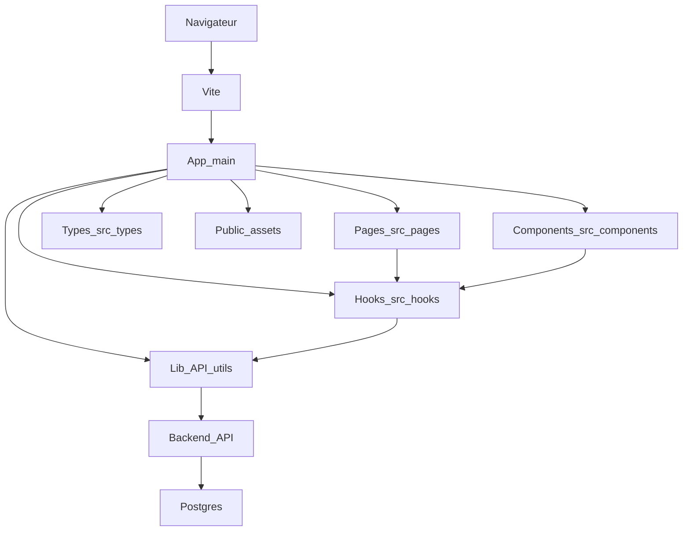

# Frontend — Carte des composants

Diagramme Mermaid (compatible) décrivant la structure principale et les flux du frontend.

Fichier SVG associé (placeholder) : `docs/frontend-component-map.svg`.

## Intégration backend

- Backend : API Express + Prisma (voir `apps/backend` pour les détails d'implémentation).
- Le frontend communique avec l'API pour obtenir les données suivantes : taxons, entrées, images, sessions de joueur, suggestions et statistiques.
- Points d'intégration typiques :
  - Requêtes REST/HTTP vers l'API pour les listes et les actions CRUD (ex : `/api/taxons`, `/api/entries`, `/api/auth`).
  - Uploads d'images gérés par des endpoints d'upload (exposé par le backend), avec stockage local dans `apps/backend/uploads`.
  - Authentification : jetons basés sur le backend (vérifier `apps/backend` middleware `auth`).

## Où chercher plus d'informations

- Implémentation backend et variables d'environnement : `apps/backend/README.md`.
- Schéma de la base de données et migrations : `apps/backend/prisma/schema.prisma` et `apps/backend/prisma/migrations`.
- Pour modifier l'URL de l'API côté frontend, chercher le client API dans `apps/frontend/src/lib`.
